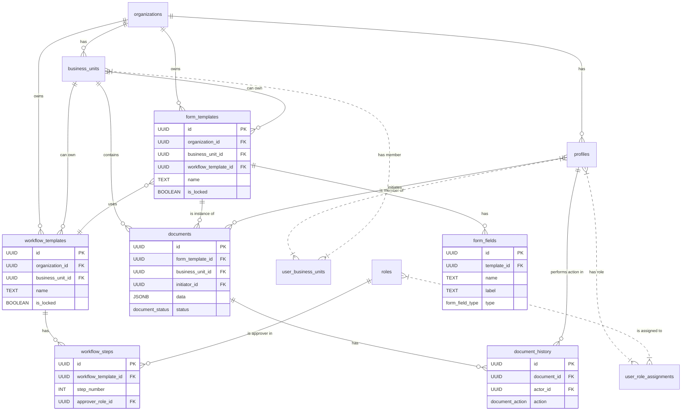

# Cascade Database Documentation

## 1. Introduction

The Cascade application uses a **Supabase (PostgreSQL)** database to store all its data. The architecture is designed to be **multi-tenant**, supporting multiple organizations, each with its own isolated set of users, business units, and data.

The primary security mechanism is **Postgres Row Level Security (RLS)**, which ensures that users can only access data they are permitted to see.

## 2. Core Concepts & Tables

The database is built around a few core entities that define the tenancy and user structure:

- **`organizations`**: The top-level entity. Every other piece of data is associated with an organization.
- **`business_units`**: An organization can be divided into multiple Business Units (BUs). BUs are containers for users and documents.
- **`profiles`**: This table extends the `auth.users` table from Supabase Authentication and stores user-specific information, including which `organization` they belong to.
- **`roles`**: Defines user permissions. Roles can be system-wide (`Super Admin`), organization-wide (`Organization Admin`), or scoped to a specific Business Unit (`BU Admin`, `Approver`, `Initiator`).
- **`user_role_assignments`** and **`user_business_units`**: These tables link users (`profiles`) to their roles and business units.

## 3. Schema Evolution: From Requisitions to Documents

The database schema has undergone a significant evolution from a rigid "Requisition" model to a flexible "Dynamic Document" model.

- **Legacy Schema**: Based on tables like `requisitions`, `requisition_templates`, and `approval_workflows`. This schema was tightly coupled to a single use case. **These tables are still in use but considered legacy.**
- **Current Schema**: A new, flexible schema has been introduced (Migration: `20251201000000_finalize_dynamic_schema.sql`), centered around `documents`, `form_templates`, and `workflow_templates`. This allows administrators to create custom forms and approval processes without changing the database schema.

**Status**: Both schemas coexist. The application is transitioning to the new dynamic document model. The legacy requisition system remains functional for backwards compatibility.

**All new development should use the Current Schema (documents, form_templates, workflow_templates).**

## 4. Current Schema: The Dynamic Document Model

This model allows for the creation of dynamic forms and workflows.

### Entity-Relationship Diagram (Mermaid)



### Table Breakdown & Data Flow

1.  **Template Creation**:
    - An **`Organization Admin`** or **`BU Admin`** creates a `workflow_template`, defining the approval steps by linking to `roles` in the `workflow_steps` table.
    - They then create a `form_template`, defining its fields in the `form_fields` table and linking it to the `workflow_template`.
    - If `is_locked` is true, it becomes a corporate standard that BU Admins cannot edit.

2.  **Document Submission**:
    - An **`Initiator`** selects a `form_template`.
    - They fill out the form, and upon submission, a new record is created in the `documents` table.
    - The `data` column stores the form's contents as a single JSON object.
    - The initial `status` is set to `SUBMITTED`, and an entry is added to `document_history`.

3.  **Approval Process**:
    - The system identifies the current approver based on the document's `current_step_id` and the associated `approver_role_id`.
    - An **`Approver`** can view the document and its data.
    - When the approver takes an action (e.g., 'APPROVE', 'REJECT'), a new entry is created in `document_history`, and the `documents.status` and `documents.current_step_id` are updated. This process continues until the workflow is complete.

## 5. Security: RLS and RPC Functions

The database is secured primarily through **Row Level Security (RLS)** policies on every table.

- **Golden Rule**: **NEVER** query data directly from the application using `supabase.from('some_table').select()`. RLS policies may not be sufficient, and this can lead to security holes or broken queries.
- **The Right Way**: Always use **RPC (Remote Procedure Call) functions** for reading data. These are PostgreSQL functions that act as a secure API layer. They contain the necessary logic to filter data based on the user's roles and permissions.

For a complete guide on RLS and the available RPC functions, see **[RLS and RPC Documentation](./rls_documentation.md)**.

## 6. Interacting with the Database

All database interactions from the Next.js application should happen through the official **Supabase client library**.

### Reading Data (SELECTs)

Always use `supabase.rpc()` to call a database function. These functions are designed to be RLS-compliant.

**Example: Fetching Business Units a user has access to.**

```typescript
// lib/supabase/actions.ts

import { createClient } from "./server"; // Your server-side Supabase client

export async function getMyBusinessUnits() {
  const supabase = createClient();

  // Call the secure RPC function instead of querying the table directly
  const { data, error } = await supabase.rpc("get_business_units_for_user");

  if (error) {
    console.error("Error fetching business units:", error);
    return [];
  }

  return data;
}
```

### Writing Data (INSERT, UPDATE, DELETE)

For write operations, you can often use the standard `.from()` syntax. RLS policies with `USING` and `WITH CHECK` clauses will automatically enforce permissions. For example, the policy will check if a user is part of the correct business unit before allowing an insert.

**Example: Creating a new document.**

```typescript
// app/(main)/documents/actions.ts

import { createClient } from '@/lib/supabase/server';

export async function createDocument(formData: any, buId: string) {
  const supabase = createClient();
  const { data: { user } } = await supabase.auth.getUser();

  if (!user) {
    throw new Error("User not authenticated");
  }

  const { data, error } = await supabase
    .from('documents')
    .insert({
      business_unit_id: buId,
      initiator_id: user.id,
      // The RLS policy will check if the user is allowed to insert
      // into this business_unit_id.
      ...
    })
    .select();

  if (error) {
    // The insert will fail if the RLS policy check does not pass.
    console.error('Error creating document:', error);
    return null;
  }

  return data;
}
```

## 7. Database Migrations

Database schema changes are managed through SQL files in the `supabase/migrations/` directory. The files are named with a timestamp prefix (e.g., `YYYYMMDDHHMMSS_description.sql`).

### Recent Critical Migrations

1. **`20251130214500_fix_insecure_rls_policies.sql`** - Fixed insecure RLS policies (introduced chat recursion bug)
2. **`20251130220000_enable_rls_on_chat_tables.sql`** - Enabled RLS on chat tables
3. **`20251130230000_create_rls_compliant_rpc_functions.sql`** - Created RPC functions for secure data access
4. **`20251201000000_finalize_dynamic_schema.sql`** - Finalized dynamic document schema
5. **`20251201010000_create_form_template_rpc.sql`** - RPC functions for form templates
6. **`20251201020000_create_workflow_template_rpc.sql`** - RPC functions for workflow templates
7. **`20251201030000_update_notifications_schema.sql`** - Updated notifications schema
8. **`20251201040000_create_form_submission_rpc.sql`** - RPC functions for form submission
9. **`20251201050000_create_document_approval_rpc.sql`** - RPC functions for document approval
10. **`20251201060000_update_comments_schema.sql`** - Updated comments schema
11. **`20251201070000_create_dashboard_rpc.sql`** - RPC functions for dashboard data
12. **`20251201080000_fix_chat_participants_recursion.sql`** - Initial attempt to fix chat recursion (failed)
13. **`20251201090000_update_chat_function_to_plpgsql.sql`** - Second attempt with PLPGSQL (failed)
14. **`20251201100000_fix_chat_recursion_final.sql`** - Third attempt with hierarchical policies (failed)
15. **`20251201110000_force_fix_chat_policies.sql`** - Fourth attempt dropping all policies (failed)
16. **`20251201120000_disable_rls_on_chat_tables.sql`** - **FINAL FIX** - Disabled RLS on chat tables (restores original working state)

### To make a schema change:

1. Create a new SQL file in the `supabase/migrations/` directory.
2. Write the `CREATE TABLE`, `ALTER TABLE`, or other DDL statements.
3. To apply migrations locally: `npm run db:push` or `supabase db push`
4. To reset database: `npm run db:reset` or `supabase db reset`
5. If migration already exists on remote: `npx supabase migration repair --status applied YYYYMMDDHHMMSS`

### Important Notes on RLS Policies

**Avoiding Infinite Recursion:**

When writing RLS policies, be careful not to create recursive lookups. For example:

```sql
-- ❌ WRONG - This causes infinite recursion!
CREATE POLICY "Users can view participants"
ON public.chat_participants
USING (
  EXISTS (
    SELECT 1 FROM chat_participants cp  -- Queries itself!
    WHERE cp.chat_id = chat_participants.chat_id
  )
);

-- ✅ CORRECT - Query different tables or use direct checks
CREATE POLICY "Users can view participants"
ON public.chat_participants
USING (
  user_id = auth.uid()  -- Direct check, no table lookup
  OR
  EXISTS (
    SELECT 1 FROM chats c  -- Different table, safe
    WHERE c.id = chat_participants.chat_id
    AND c.creator_id = auth.uid()
  )
);
```

**Chat System - RLS Disabled:**

The chat tables (`chats`, `chat_messages`, `chat_participants`) have **RLS disabled** by design:

- Chat is cross-organizational - users can message anyone in the system
- Unlike business units, chat doesn't require multi-tenant data isolation
- Security is handled at the application/API layer, not database RLS
- This matches the original implementation from the `chat-feature` branch
- Attempts to enable RLS on chat tables caused infinite recursion errors

**Why RLS is disabled on chat:**

```sql
-- Chat tables intentionally have RLS disabled
ALTER TABLE public.chats DISABLE ROW LEVEL SECURITY;
ALTER TABLE public.chat_messages DISABLE ROW LEVEL SECURITY;
ALTER TABLE public.chat_participants DISABLE ROW LEVEL SECURITY;
```

Security is maintained through:

- Supabase Auth (only authenticated users can access)
- API route filtering based on chat participation
- Frontend logic showing only relevant chats
